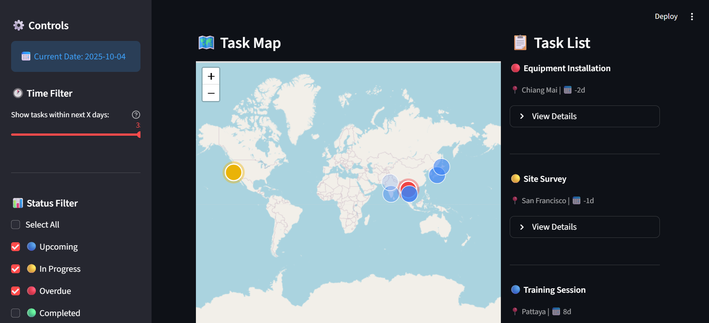

# Space Time PM



## Quick Start

1. Clone the repository:
```bash
git clone https://github.com/inecrft/SpaceTimePM.git
cd SpaceTimePM
```

2. Create a virtual environment:
```bash
conda create --name space-time-pm python=3.13
conda activate space-time-pm
```

3. Install dependencies:
```bash
pip install -r requirement.txt
```

4. Run the application:
```bash
streamlit run app.py
```